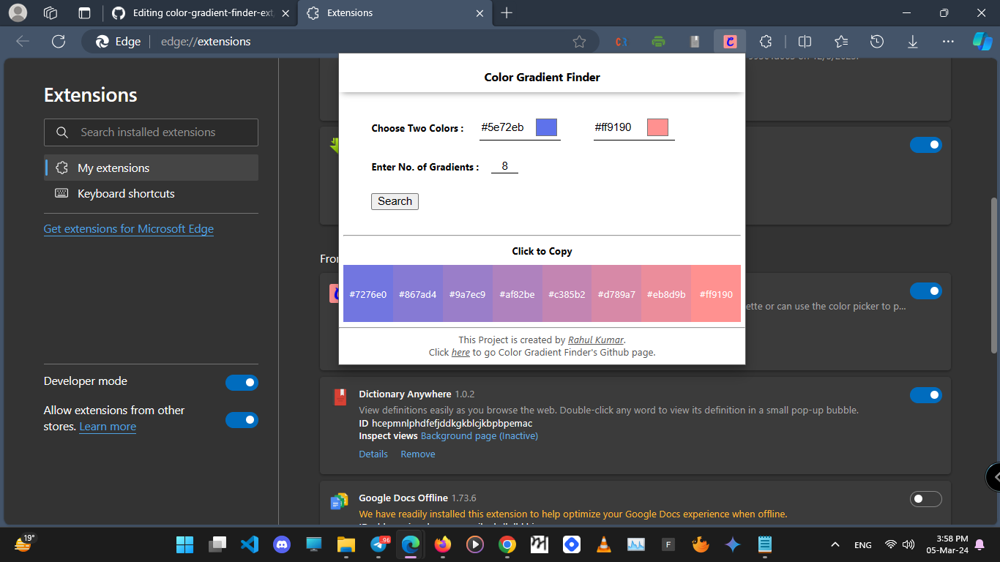
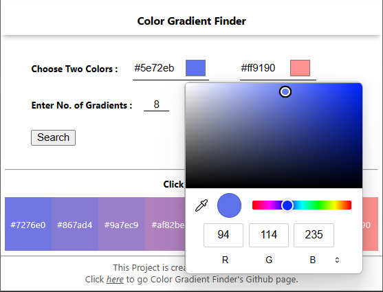

# Introduction :

Hi! This is a Color gradient finding extension. This project has been created by [Rahul Kumar](https://www.linkedin.com/in/rahulkumarpahwa/) as a part of learning FrontEnd Development.

# Features :

This Extension has following Features :

1. You can find the gradient between the two colors you choose or either entered in Hex.
2. You can also choose the number of gradients you want in between the two colors you passed.

# Tech Stack :

- Reactjs
- React Hooks
- Parcel
- Javascript
- Manifest.json
- Css

# Usage:

To get the extension on your system you can follow the process as below:

1. Download the Zip File by clicking [here](https://github.com/rahulkumarpahwa/color-gradient-finder-ext/raw/main/extension.zip)
2. Extract the Zip file and Take out the Extension folder from it.
3. Open Chrome and go to the Extensions page by Click the Three dots > More tools > Extensions.
4. Toggle the Developer mode switch to On.
5. Click the "Load unpacked" button and select the Extension Folder inside the another Extension Folder where your files are saved.
6. Toggle the switch on to Active the new Added Extension.
7. Ta-da! The extension has been successfully installed. You can also pin it if you want.

### Screenshot :

